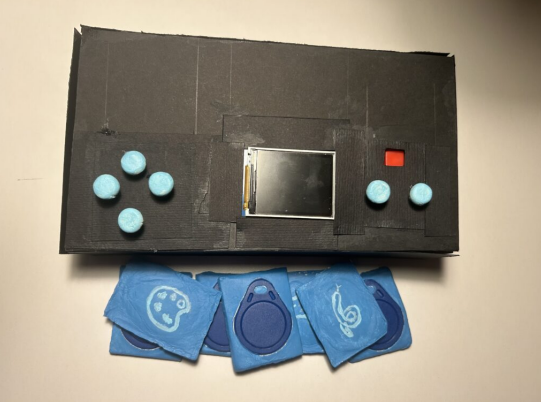
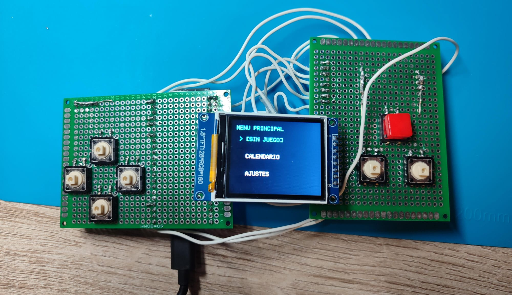
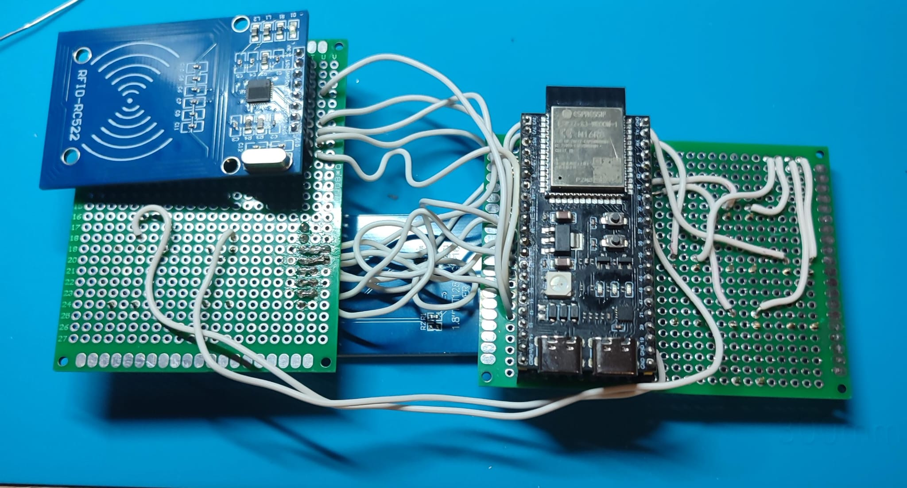
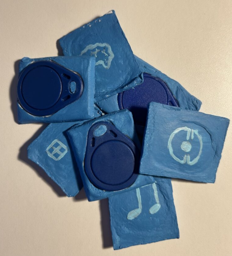
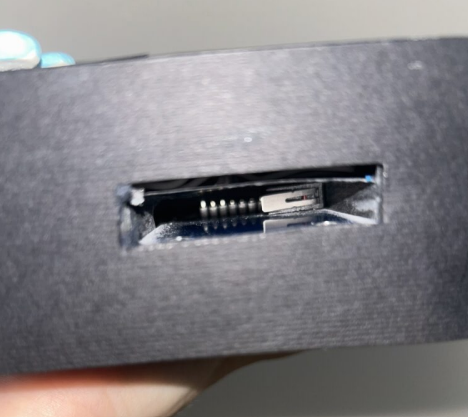

# 🎮 Retro Boy

> ⚠️ This repository is a personal version (_fork_) of an academic team project.  
> Its purpose is to showcase my work and contributions to the development of a portable console based on embedded systems.

Retro Boy was developed as an academic project for a Computer Engineering course at **Universidad Rey Juan Carlos**.

For a more detailed overview of the development process, including additional media and videos, you can visit the project blog:

➡️ [Read the project blog post](https://blogs.etsii.urjc.es/dseytr/retro-boy-la-consola-perfecta-para-los-nostalgicos/)

## 📌 Description

**Retro Boy** is a retro portable console based on embedded systems, inspired by classic devices such as the **Game Boy Advance** and **Game & Watch**.

The project was carried out within the context of a Computer Engineering degree course at **Universidad Rey Juan Carlos**, combining software development, electronics, hardware integration and physical prototyping.

The system combines:

- **C++** programming
- **ESP32-S3** microcontroller
- TFT display
- RFID reader
- Physical buttons
- Audio through a buzzer
- Physical cartridges
- A fully handmade portable prototype

---

## 📷 Final Result




---

## 🚀 Main Features

- Functional portable console based on ESP32-S3
- Physical cartridge system with RFID identification
- Physical button interface
- ST7735S TFT display
- Passive buzzer audio system
- Modular software architecture
- Finite State Machine to control the execution flow
- Game management through a common interface
- Handmade soldered prototype
- Handmade case and physical cartridges

---

## 🧠 System Architecture

The core logic of Retro Boy is based on a **Finite State Machine (FSM)** responsible for controlling the general behavior of the console.

This architecture makes it possible to clearly manage transitions between the different system modes:

- Console powered off
- Main menu
- Calendar
- Settings
- Waiting for cartridge
- Loading game
- Game execution

```cpp
enum ConsoleState {
  STATE_OFF,
  STATE_MENU,
  STATE_CALENDAR,
  STATE_SETTINGS,
  STATE_WAITING_CART,
  STATE_LOADING_GAME,
  STATE_GAME_RUNNING
};
```

Using an FSM helps organize the execution flow and improves system maintainability by clearly separating each console behavior.

---

## ⚙️ Hardware

### Main Components

- **Microcontroller:** ESP32-S3
- **Display:** ST7735S TFT display, 128x160 pixels
- **RFID reader:** MFRC-522
- **Audio:** passive buzzer
- **Power supply:** 3 AA batteries
- **User interface:** 7 physical buttons
- **Cartridges:** physical modules with integrated RFID chips

---

### Technical Details

The system uses a **shared SPI bus** between the TFT display and the RFID reader. To avoid communication conflicts between both peripherals, a manual **Chip Select (CS)** control mechanism was implemented.

This allows the console to activate only the device that needs to use the bus at each moment, preventing interference between the display and the RFID reader.

---

## 🖥️ Software

The software is developed in **C++** and follows a modular object-oriented design.

The architecture is divided into several main blocks:

- Console base interface
- Menu system
- State management
- Input handling
- Display control
- Sound control
- Cartridge identification system
- Game library

---

## 🧩 Common Game Interface

Games are integrated into the console through a common interface called `IGame`.

Each game must implement the required methods to initialize itself, update its state, render on the screen and finish its execution properly.

```cpp
class IGame {
public:
  virtual void init() = 0;
  virtual void update(const InputState& in) = 0;
  virtual void render(Adafruit_ST7735& tft, SoundManager& sound) = 0;
  virtual void exit() = 0;
  virtual ~IGame() {}
};
```

This structure allows new games to be added without modifying the main core of the console, making the system more scalable and maintainable.

---

## 🎮 Implemented Games

The console includes several games developed and integrated into the common architecture:

- **Color Game**
- **Tetris**
- **Snake**
- **Memory Game**
- **Dance Revolution**
- **Pokémon Battle Simulator**

Each game follows the `IGame` interface, allowing all of them to work consistently within the main loop of the console.

---

## 🕹️ Cartridge System

One of the most distinctive features of the project is its physical cartridge system.

Each cartridge contains an RFID chip with a unique identifier. When a cartridge is inserted into the console:

1. A physical switch detects the presence of the cartridge.
2. The RFID reader reads the chip identifier.
3. The system compares the read UID with the registered game list.
4. If a match is found, the corresponding game becomes available from the menu.

This system recreates the physical experience of classic cartridge-based consoles, combining it with a modern RFID-based implementation.

---

## 📷 Gallery


### Soldered Prototype




---

### Physical Cartridges



---

### Cartridge Slot



---

#### Console in Use

Additional videos showing the console in operation are available in the project blog:

➡️ [View videos and development details in the blog post](https://blogs.etsii.urjc.es/dseytr/retro-boy-la-consola-perfecta-para-los-nostalgicos/)

---

## 🛠️ Prototype Construction

The physical prototype was built on perforated PCBs, manually soldering the main components and creating power buses to distribute energy inside the system.

The console also includes a handmade case built with lightweight materials, designed to protect the electronics and allow comfortable use of the device.

The physical design includes:

- Top cartridge slot
- Access to the ESP32 USB-C port
- Battery compartment
- Display opening
- Custom physical buttons
- Internal component fixation

---

## 🧱 Case Materials

Simple and easy-to-work-with materials were used to build the physical console:

- Foam board
- Black cardboard
- Air-dry clay
- Acrylic paint
- White glue
- Hot glue
- Plastic tubes for the buttons

The cartridges were also handmade, integrating the RFID chips used to identify each game.

---

## 🔧 Technical Challenges Solved

### Shared SPI Bus Management

One of the main technical challenges was managing the communication between the TFT display and the RFID reader, since both devices use the SPI bus.

To solve this, selection functions were implemented to enable and disable each peripheral through its **Chip Select** pins, preventing conflicts on the data bus.

---

### Physical Cartridge Detection

Another important challenge was ensuring that the console could correctly detect when cartridges were inserted and removed.

The solution combined:

- A mechanical switch to detect physical presence
- An RFID reader to identify the game
- Control logic that only activates RFID reading when a new cartridge insertion is detected

This improved system stability and avoided unnecessary RFID readings during normal console execution.

---

## 🧑‍💻 Authorship and Repositories

This project was originally developed as an academic team project.

### Original Repository

- https://github.com/armiiin-13/gba-console

### Authors

- **Arminda García Moreno**  
  GitHub: https://github.com/armiiin-13

- **David Díaz Gómez-Escalonilla**  
  GitHub: https://github.com/dadigoes-io

---

## 💡 My Contributions

My main contributions to the project were:

- Development of the initial breadboard prototype.
- Technical validation of the main components.
- Research and implementation of a modular system architecture.
- Use of PlatformIO as the development environment.
- Application of polymorphism concepts through virtual functions.
- Implementation of low-level logic for the shared SPI bus.
- Management of communication between the TFT display and the RFID reader.
- Development of the base console interface logic.
- Implementation of the menu, settings and calendar screens.
- Soldering of critical components, including the display.
- Prior research on soldering techniques for perforated PCBs.

---

## 🤝 Team Work

In addition to the individual contributions, several parts of the project were developed collaboratively:

- Implementation and integration of the game library.
- Adaptation of classic game logic to the Retro Boy architecture.
- System testing and validation.
- Planning the placement of components on the perforated PCBs.
- Documentation of the development process.
- Writing the project report.
- Recording demo videos showing the system in operation.

---

## 🎯 What I Learned

This project allowed me to deepen my knowledge in several key areas of embedded systems development:

- Design of integrated hardware/software systems.
- C++ programming for microcontrollers.
- Direct peripheral control.
- SPI communication.
- Use of interrupts.
- Finite State Machine-based design.
- Memory management in resource-constrained systems.
- Separation between application logic and hardware.
- Soldering and physical prototype assembly.
- Integration of software, electronics and physical design into a single functional product.

---

## 📜 License

Academic project developed for educational purposes.

This repository is maintained as a personal fork to showcase my contributions, learning process and progress in the field of embedded systems.